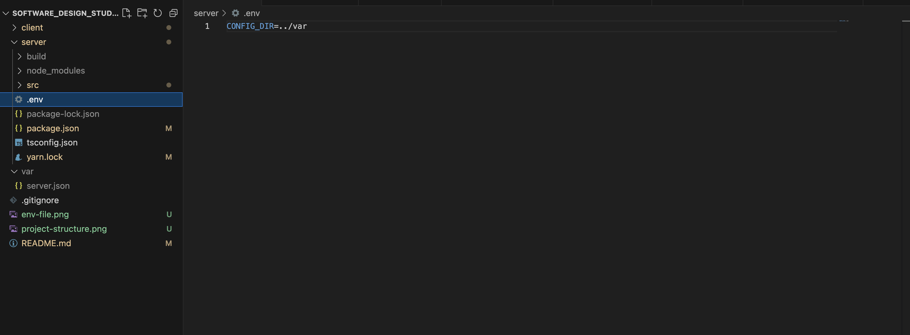

# SDS-Group-Arrangement-System

Software Design Studio Monday Group 2 - Group Arrangement System

# Contributors 

| Name | Git Profile |  Role |
| ------------- | ------------- | ------------- |
| Leo Kochappan | @lkochappan | Team Lead | Quality Assurance |
| Tarun Raja | @TarunRJ | Dev |
| Kishan Velmurugan | @Ketchan0307 | BA/UI Designer | Quality Assurance | Dev |
| Moses Buta | @ethmoses1 | Tech Lead |
| Jasmine Trinh | @JasmineTrinh | Dev |
| Umair Khalidi | @umairkhalidi | Dev | 
| Rohith Shivalingam | @Rohith1106 | Dev |

# Project Setup 

## Tools you need 
1. Visual Studio Code or any IDE of your choice
2. Node needs to be install on your machine. 
    Check if you have node installed: "node --version" on the terminal. 
    If you don't have node, install it for your device. [https://nodejs.org/en/download]
   - The project expects node 16 so make sure you're running node 16
3. We will be using "yarn" instead of "npm" for this project

## Developmenet 
1. Clone repository: git clone https://github.com/SDS-Group-Arrangement-System/SDS-Group-Arrangement-System.git 
2. The project will have the folowing structure. 
    

    - The var folder is used to store sensitive details such as the MongoDB creditionals. It will have a file called "server.json"
    - Create a var folder and a file called "server.json" inside it 
    - To make the project access the "server.json" file create a .env file inside of the server folder. See image below
    - Inside of the .env file add this "CONFIG_DIR=../var"
    - The contents of the "server.json" file will be on teams.
    
    
2. There are two main folder (directories) client and server. 
    In one terminal window run: cd client && yarn && yarn start
    In another terminal window run: cd server && yarn && yarn start:dev
3. Now you should be ready for development 

